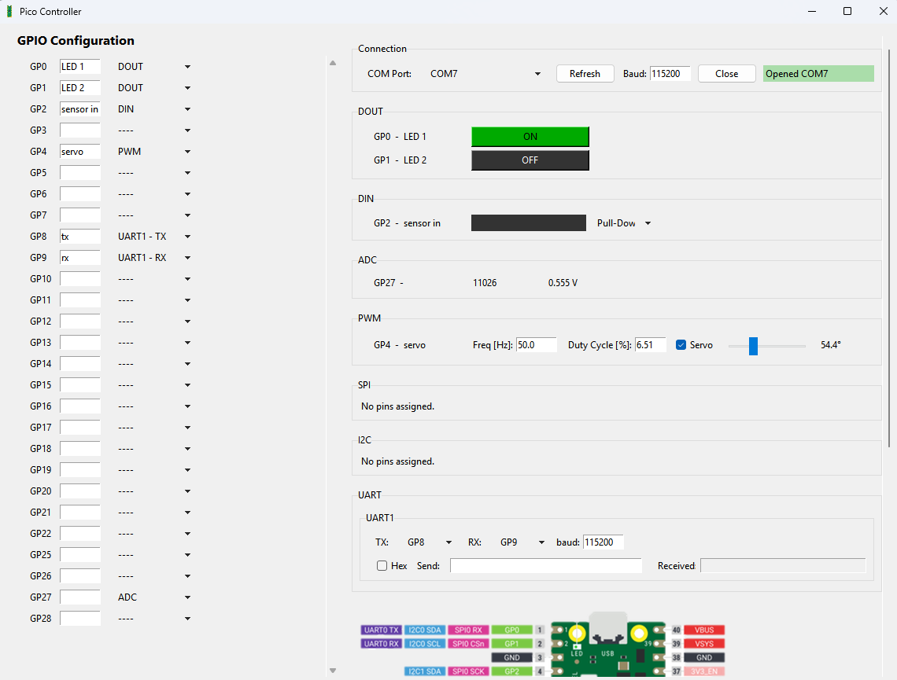

# Pico Controller

This project was speed up the process for hardware level troubleshooting for embedded projects involving the RP2040 and RP2350 (Raspberry Pi Pico and Pico 2) microcontrollers.

This provides a GUI to control and monitor every pin's available functions, including digital in, digital out, PWM, SPI, I2C, UART and ADC.

## Using the Pico Controller

First, flash the pico with micropython and upload main.py

disconnect and reconnect the board from your computer

Run picoController.py and connect to the microcontroller through the COM port selection.

## GPIO Configuration
On the left panel, each pin can be configured in any available mode using the dropdown menu. Each pin can also be given an alias to help keep track of them all. 

## Digital Out (DOUT)
Any pin can be configured as a digital output. When selected, that pin will appear in the right panel with a toggle button. This can be used to turn the pin on and off.

## Digital In (DIN)
Similarly, any pin can be configured as a digital input. When selected, the state of the pin will be displayed by a coloured box, either black for off or green for on. 

The pin can also be configured with pull-up, pull-down or none.
Note that for the RP2350 (Pico 2), the pull-down function may fail silently due to a known hardware bug.

## ADC
There are 3 available ADC pins, GP26, GP27 and GP28. When selected, the ADC will continuously read the 16-bit value and the measured voltage (0V - 3.3V) at 10Hz.

## PWM
Any pin can be configured as a PWM output. The frequency can be set from 10Hz to 10Mhz. At 10Mhz, it is generally more of a triangle wave.
The Duty cycle can be set by either entering a percentage or using the slider.
Upon changing the frequency, the duty cycle is reset (although this is not updated on the display), and must be readjusted.

The servo checkbox sets the frequency to 50Hz and the duty cycle between 5 and 10%. The slider can be used to adjust the servo angle in degrees.

## SPI
SPI is very flexible, but requires at least a SCK pin to be selected for anything to happen. CSn, MISO and MOSI are optional.
There are many pins which perform the same SPI function, such as GP2 and GP6 for SPI0 - SCK. Many of these pins can be selected on the left, but only one pin can be used for the actual communication. This is what the drop down on the right panel is for.
The communication speed can be set in kilobits per second and data can be sent in either hexadecimal or ascii, depending on if the "Hex" check box is checked. Any data received will be displayed in "Received Bytes" in hexadecimal. This where any errors will be displayed.

When entering hex, for a valid data, it must contain an even number of characters, but can be entered in any format. For example, "1A 58 9F" or "1A589F" or "1a589f" are all valid.

## I2C
I2C is largely the same deal as SPI, but requires both SDA and SCL pins to be specified. It has a "scan" button, which will report any i2c devie addresses on that bus in hexadecimal.

## UART
UART is very flexible. It can be configured with both TX and RX for full-duplex, or just one of the two for simplex communication. The data to be sent can either be entered in ASCII or hex, selectable by the Hex checkbox, but will be received in ASCII.